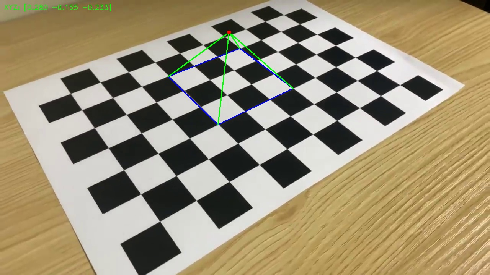
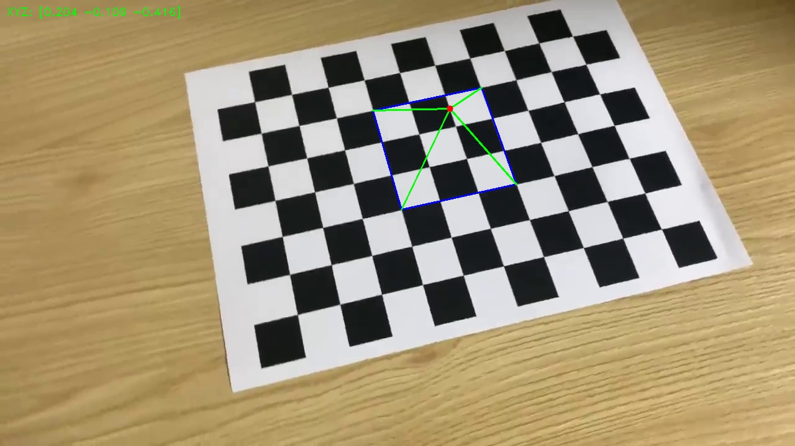

# Camera Pose Estimation and AR

이 프로젝트는 이전 과제(카메라 캘리브레이션)에서 구한 카메라 내부 파라미터(K 행렬, 왜곡 계수)를 활용하여 카메라 포즈를 추정하고, 영상 속 체스보드 위에 3D AR 가상 물체(피라미드)를 증강하는 프로그램입니다.

## 1. 캘리브레이션 파라미터 적용 값

`hw3`에서 계산된 카메라 캘리브레이션 결과를 `ChessboardAR` 스크립트에 적용했습니다.

- **Camera Matrix (K)**:
  - $f_x$ (초점 거리 x): 1161.7373
  - $f_y$ (초점 거리 y): 1131.5658
  - $c_x$ (주점 x): 639.3790
  - $c_y$ (주점 y): 305.4894

  $$ K = \begin{bmatrix} 1161.7373 & 0 & 639.3790 \\ 0 & 1131.5658 & 305.4894 \\ 0 & 0 & 1 \end{bmatrix} $$

- **Distortion Coefficients (왜곡 계수)**:
  - $k_1, k_2, p_1, p_2, k_3$: `[0.1868, -0.8840, 0.0007, 0.0007, 1.0367]`

---

## 2. AR 물체 표시 데모

`ChessboardAR` 스크립트 실행(`python ChessboardAR`) 시 다음 과정이 차례대로 수행됩니다:

1. 영상(`chessboard.mp4`)을 프레임 단위로 읽어옵니다.
2. 매 프레임마다 `cv.findChessboardCorners`를 이용해 체스보드 코너를 찾고, `cv.solvePnP`로 카메라 포즈(RT 행렬, Translation/Rotation)를 계산합니다.
3. 알아낸 카메라 포즈 정보를 바탕으로 3D 피라미드를 2D 영상평면에 투영(`cv.projectPoints`)하여 렌더링합니다.
4. 화면 좌측 상단에 실시간 카메라의 상대적 위치(XYZ)가 표시됩니다.

<<<<<<< HEAD

---

=======

>>>>>>> d29895b5fcd7ec3d7f2dd66cba80726bd2528fe7
